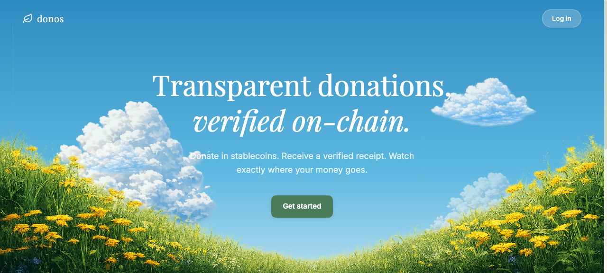

# donos



> Transparent donations on XRPL. Donate in stablecoins, receive verified on-chain receipts, and trace every fund movement from wallet to real-world impact.

Built for the **XRPL Commons Hackathon — Challenge 4 (TrustBond)**.

## What is Donos?

Donos is a donation transparency platform where:
- **Donors** send RLUSD or XRP to NGO treasuries via Xaman wallet
- **NGOs** receive funds and automatically issue **DONO receipt tokens** as proof of donation
- **Everyone** can trace fund movements on-chain with verifiable transaction hashes
- **Anomaly detection** flags suspicious NGO behavior automatically

No blockchain expertise required — donors just connect their wallet and donate.

## Architecture

[4-account pipeline diagram description]

1. **Donor** — connects Xaman wallet, sends RLUSD or XRP
2. **Treasury** — NGO-owned account receiving donations (on-chain source of truth)
3. **Issuer** — NGO-owned account that mints DONO receipt tokens
4. **Distributor** — NGO-owned account that delivers DONO to donors

Each NGO controls all three operational accounts. The platform coordinates but never holds funds.

Full architecture: [`docs/architecture/donation-infrastructure.md`](docs/architecture/donation-infrastructure.md)

## Key Features

- **Dual currency donations** — Accept both native XRP and RLUSD stablecoins
- **On-chain receipts** — DONO tokens as immutable proof-of-donation (XRPL issued currencies)
- **Trustline management** — Automated trustline setup via Xaman signing
- **Cross-currency pathfinding** — XRPL ripple_path_find for XRP→RLUSD conversion
- **NGO credibility scoring** — 3-factor rating (transparency, activity, donor diversity)
- **Anomaly detection** — Automated flags for suspicious treasury behavior
- **Radial bloom visualization** — Interactive SVG showing donation impact
- **Money flow diagrams** — River diagrams tracing fund allocation
- **Blockchain details** — Account addresses, trustline info, base reserve display
- **Real testnet transactions** — 20+ verified tx hashes on testnet.xrpl.org

## Tech Stack

| Layer | Stack |
|-------|-------|
| Frontend | React 19, Vite, TypeScript, Tailwind CSS v4 |
| Backend | FastAPI, Python 3.13, xrpl-py, Pydantic |
| Blockchain | XRPL Testnet, RLUSD, DONO tokens |
| Wallet | Xaman (XUMM) via REST API |
| Database | Supabase (PostgreSQL) |
| Design | Solarpunk aesthetic, liquid glass UI |

## Getting Started

### Prerequisites
- Node.js 20+
- Python 3.12+
- [uv](https://docs.astral.sh/uv/) package manager
- Xaman wallet (testnet mode)

### Frontend
```bash
cd frontend
npm install
npm run dev        # http://localhost:5173
```

### Backend
```bash
cd backend
cp .env.example .env   # Fill in real values
uv sync
uv run python -m app.main   # http://localhost:8000
```

### XRPL Testnet Setup
```bash
cd backend
# Create and fund NGO wallets on testnet
uv run python scripts/setup_ngo_wallets.py

# Seed real transactions (trustlines, donations, DONO issuance)
uv run python scripts/seed_real_transactions.py

# Fund a wallet with RLUSD (optional)
uv run python scripts/fund_wallet_rlusd.py <address> 100
```

## Project Structure
```
donos/
├── frontend/                    # React SPA
│   └── src/
│       ├── pages/               # Landing, Connect, AppView, Donate, NGOProfile, Profile, Initiative
│       ├── contexts/            # WalletContext (Xaman integration)
│       ├── hooks/               # useWallet
│       ├── utils/               # API client, constants
│       └── types/               # TypeScript interfaces
├── backend/                     # FastAPI server
│   └── app/
│       ├── routers/             # ngos, donations, wallet endpoints
│       ├── services/            # DonationProcessor, XRPLPyService, XamanService
│       ├── models/              # Domain models, state machine
│       └── schemas/             # Pydantic request/response models
├── docs/
│   ├── architecture/            # XRPL donation flow blueprint
│   └── business-analysis.md     # Trust metrics, efficiency analysis
└── scripts/                     # Testnet setup, wallet funding
```

## API Endpoints

| Method | Path | Description |
|--------|------|-------------|
| GET | /ngos | List all NGOs |
| GET | /ngos/{id} | NGO details |
| GET | /ngos/{id}/rating | Credibility score + anomaly flags |
| GET | /ngos/{id}/diagnostics | Operational readiness check |
| POST | /ngos/{id}/trustline/prepare | Prepare TrustSet transaction |
| POST | /ngos/{id}/trustline/verify | Check trustline status |
| GET | /donations | List donations (filterable) |
| GET | /donations/donor/{addr}/tree | Donor impact tree |
| POST | /donations/pathfind | Cross-currency path discovery |
| POST | /donations/reprocess | Trigger donation processing |
| POST | /wallet/connect | Create Xaman SignIn payload |
| POST | /wallet/sign | Create Xaman signing payload |
| GET | /wallet/payload/{uuid} | Poll Xaman payload result |

## XRPL Concepts Covered

- **Trustlines** — per-NGO trustline for DONO token receipt
- **Issued Currencies** — DONO tokens as proof-of-donation IOUs
- **Base Reserve** — 1 XRP minimum + 0.2 XRP per trustline
- **Pathfinding** — ripple_path_find for cross-currency donations
- **DefaultRipple** — enabled on all issuers for token distribution
- **4-Account Architecture** — separation of treasury, issuer, distributor roles

## Business Analysis

See [`docs/business-analysis.md`](docs/business-analysis.md) for:
- Trust metrics and credibility scoring
- Fundraising efficiency comparison
- Anomaly detection system
- Future roadmap

## Team

Built for the XRPL Commons Hackathon 2026.
